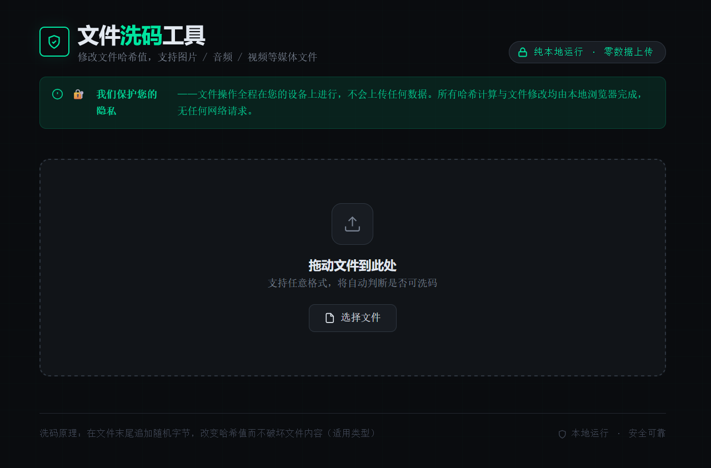
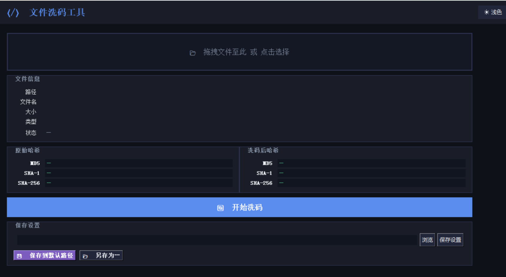

file-rehasher是在本地修改文件的哈希值（MD5 / SHA-1 / SHA-256 / SHA-512）的文件洗码工具。

我们希望它可以在以下场景帮助到你：

1.保护你的文件不被轻易识别检测。**在本地或网盘存储文件时，降低被自动识别、标记或失效的可能性，让文件更稳定、更不容易“消失”。**

2.保护你的言论和通讯自由。在受限环境中，帮助文件更安全、更稳定地传播。降低被监控审查系统识别的概率，提高监测与追踪的成本，**防止监控者通过追踪文件哈希关联到你。**(更完善的监控系统仍可以通过其它技术 如图片隐藏水印 来追踪你)

3.**分享被标记的资源，如果你的资源被网盘标记，无法分享。你可以在洗码后分享给他人。**

提供两个独立的实现版本：

| 版本 | 文件 | 适用场景 |
|---|---|---|
| 网页版 | `index.html` | 浏览器直接打开，可部署静态网页，无数据上传。 |
| 桌面版 | `main.py` | 包含GUI，可在Windows上直接运行。 |

---

## 功能特性

- **哈希计算** — 同时展示洗码前后的哈希值，支持 MD5 / SHA-1 / SHA-256 / SHA-512
- **文件类型分类** — 自动识别文件风险等级，拒绝损坏文本/代码文件
- **PNG 智能注入** — PNG 文件通过写入 `wASH` 私有 chunk 实现洗码，不影响图像内容
- **一键保存** — 支持另存为 / 快速下载（网页版）或保存到默认路径（桌面版）

---

## 文件类型支持

| 类型 | 示例 | 处理策略 |
|---|---|---|
| ✅ 安全媒体 | JPG / GIF / MP4 / MP3 / MKV … | 直接洗码（末尾追加随机字节） |
| ✅ PNG 图片 | `.png` | 注入 `wASH` chunk（结构安全） |
| ⚠️ 风险格式 | PDF / ZIP / EXE / DOCX / APK … | 警告后允许，建议提前备份 |
| ❌ 文本/代码 | TXT / JSON / PY / JS / CSV … | 拒绝洗码（追加二进制会破坏内容） |
| ❓ 未知类型 | 无列表内扩展名 | 提示确认后允许 |

---

##  快速开始

### 网页版（`index.html`）支持多个平台

无需安装任何依赖，直接用浏览器打开即可。

你也可以将其部署为静态网站，托管在自己的服务器上，或使用免费的平台（如 GitHub Pages、Cloudflare Pages）。
洗码过程不会上传或传输任何数据，所有操作均在浏览器本地完成。



---

### 桌面版（`main.py`）

**环境要求：**
- Python 3.10+
- 自行安装所需的库

**运行：**

双击打开或执行：
```bash
python main.py
```



---

## 洗码过程

```
普通文件：  [原始数据] + \x00WASH\x00 + [16字节随机数]
PNG 文件：  [PNG头] + ... + [wASH chunk] + [IEND chunk]
```

在文件末尾追加随机字节不会影响图片、视频、音频等媒体文件的正常打开与播放；PNG 则通过写入符合规范的私有 chunk 实现，完全兼容所有图像查看器。

---

## 免责声明

本工具仅供学习与个人使用。请勿将其用于规避版权保护。使用前请自行备份原始文件，作者不对数据损失承担责任。
